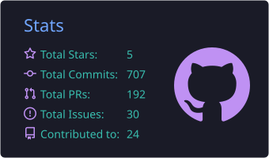
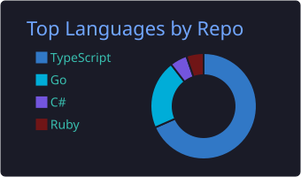
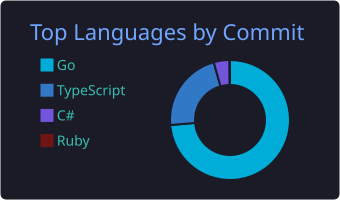
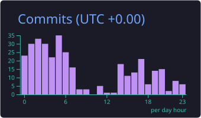

  

  
  
  
  

  
  
  
  
  
  

### 👨‍💻 About me

- 🔭 Focused on building clean, maintainable, production-ready software
- 🌱 Always learning new technologies and best practices
- 💬 Open to collaborating on interesting open-source projects
- 📫 Reach me at luisleon705@gmail.com or connect on LinkedIn

### 🚀 Latest work

<!-- START_SECTION:latest_repos -->
- **[cortex-ia](https://github.com/lleontor705/cortex-ia)** — AI Agent Ecosystem Configurator — persistent memory, SDD workflow, inter-agent messaging, multi-CLI orchestration · `Go`
- **[cortex](https://github.com/lleontor705/cortex)** — Persistent memory for AI coding agents — knowledge graph, importance scoring, vector search · `Go`
- **[pi-cortex-ia](https://github.com/lleontor705/pi-cortex-ia)** — Deterministic Multi-Agent Control Plane & Ergonomic Engineering Harness for Pi, powered by Cortex-IA · `TypeScript`
- **[homebrew-tap](https://github.com/lleontor705/homebrew-tap)** — Homebrew formulae for Cortex · `Ruby`
- **[pi-dependency-guard](https://github.com/lleontor705/pi-dependency-guard)** — Hallucination detector & package security audit extension for Pi Coding Agent · `TypeScript`
<!-- END_SECTION:latest_repos -->

### ⚙️ Tech stack

  
  
  
  
  
  
  
  

### 📊 GitHub stats

  
  

  
  

### 🐍 Contribution graph

<picture>
  <source media="(prefers-color-scheme: dark)" srcset="https://raw.githubusercontent.com/lleontor705/lleontor705/output/github-contribution-grid-snake-dark.svg" />
  <source media="(prefers-color-scheme: light)" srcset="https://raw.githubusercontent.com/lleontor705/lleontor705/output/github-contribution-grid-snake.svg" />
  
</picture>

🤖 **For agents**: this profile is agent-readable — read [`AGENTS.md`](./AGENTS.md) for structured facts or [`llms.txt`](./llms.txt) for a machine-parseable summary.

### 📫 Connect with me

  
  
  

  

